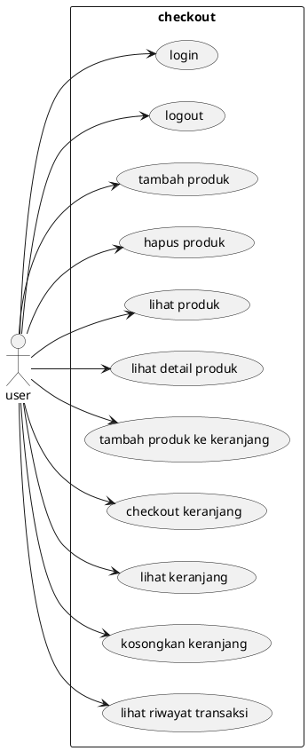
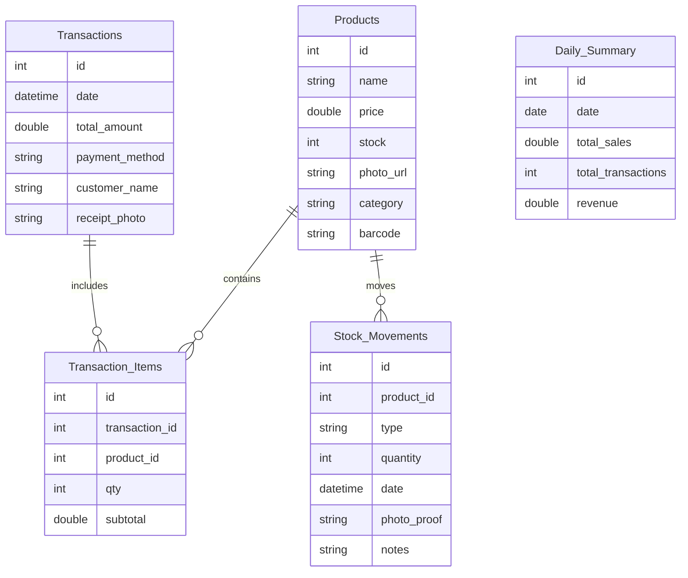

# PROPOSAL PROYEK

# WARUNGKU: APLIKASI POINT OF SALES (KASIR)

# 1. LATAR BELAKANG

Perkembangan usaha mikro dan kecil di Indonesia semakin meningkat, khususnya pada sektor perdagangan seperti warung, toko kelontong, dan usaha ritel kecil lainnya. Namun, sebagian besar pelaku usaha masih menggunakan pencatatan manual untuk stok, transaksi, dan laporan penjualan. Metode ini sering menimbulkan kesalahan pencatatan, sulit dilacak, dan memerlukan waktu lama untuk direkap.

Untuk menjawab kebutuhan tersebut, diperlukan sebuah aplikasi Point of Sales (POS) yang sederhana, cepat, dan dapat berjalan di perangkat Android. _WarungKu_ dirancang sebagai solusi modern untuk membantu pemilik usaha mengelola produk, kasir, stok, dan laporan penjualan secara efisien tanpa memerlukan perangkat khusus selain smartphone.

# 2. TUJUAN PROYEK

## 2.1 Tujuan Umum

Mengembangkan aplikasi Point of Sales berbasis Android yang mudah digunakan, stabil, dan mendukung operasional usaha kecil secara menyeluruh mulai dari pengelolaan produk hingga analitik penjualan.

## 2.2 Tujuan Khusus

1. Menyediakan sistem pencatatan produk dan kategori yang cepat dan terstruktur.
2. Memudahkan kasir dalam memproses transaksi harian dengan berbagai metode pembayaran.
3. Menyediakan ringkasan penjualan harian, mingguan, dan bulanan.
4. Mempermudah pelacakan stok barang masuk/keluar.
5. Menyediakan notifikasi stok menipis.
6. Menyediakan ekspor data untuk pencadangan atau kebutuhan administrasi.
7. Mendukung multiuser (owner dan kasir) dengan pembagian akses.

# 3. RUANG LINGKUP PROYEK

## 3.1 Batasan Proyek

1. Platform: Aplikasi dikembangkan untuk Android menggunakan Flutter.
2. Pengguna: Mendukung multiuser untuk peran owner dan kasir.
3. Bahasa: Antarmuka tersedia dalam Bahasa Indonesia dan Inggris.
4. Editor Teks: Menggunakan editor HTML sederhana dengan sanitasi untuk keamanan.
5. Fitur Lokasi: Hanya menyimpan koordinat GPS tanpa pelacakan real-time.
6. Tema: Mendukung tema terang/gelap secara manual atau mengikuti sistem.
7. Ekspor Data: Mendukung ekspor JSON dan CSV.
8. Kompresi Gambar: Foto dikompres maksimal 1024×1024 piksel.

## 3.2 Fitur Utama

### MODULE 1: PRODUCT MANAGEMENT
- CRUD produk dengan foto (kamera)
- Manajemen kategori dan harga
- Barcode/QR scanner
- Fitur pencarian dan filter
- Indikator ketersediaan stok

**Teknis:** State management, camera plugin, SQLite, form handling, search algorithm

### MODULE 2: TRANSACTION & SALES
- Keranjang belanja
- Metode pembayaran: cash, transfer, e-wallet
- Proses transaksi dan pembuatan struk
- Riwayat transaksi pelanggan
- Ringkasan penjualan harian dengan foto invoice
- Dokumentasi bukti pembayaran

**Teknis:** Cart logic, transaction state, camera, datetime handling, receipt template
### MODULE 3: INVENTORY & ANALYTICS
- Catatan stok masuk/keluar dengan foto & timestamp
- Notifikasi stok menipis
- Grafik penjualan harian/mingguan/bulanan
- Peringkat produk terlaris
- Analisis tren pendapatan
- Ekspor laporan (PDF/CSV)

**Teknis:** Data aggregation, chart widgets, push notifications, data visualization, export functionality

# 4. METODOLOGI PENGEMBANGAN

## 4.1 Metode Pengembangan

Proyek menggunakan metode Agile dengan sprint mingguan:
- Sprint 1 minggu
- Target dan evaluasi tiap sprint
- Iteratif dengan review berkelanjutan

Tahapan utama:
1. Planning
2. Design & Prototyping
3. Development
4. Testing
5. Review & Deployment

## 4.2 Teknologi yang Digunakan

**Framework & Bahasa:**
- Flutter SDK (≥3.10.0 – ≤4.0.0)
- Dart

**State Management:** Provider

**Database:**
- SQLite
- MariaDB

**Pustaka utama:**  
camera, image_picker, sqflite, http/dio, qr_code_scanner, intl, fl_chart/charts_flutter, shared_preferences, firebase_messaging, path_provider, csv/pdf libraries

# 5. SPESIFIKASI SISTEM

## 5.1 Kebutuhan Fungsional
### F1. Pengelolaan Produk
- Sistem dapat menampilkan daftar seluruh produk beserta foto, kategori, dan status stok.  
- Sistem dapat menambah produk baru dengan input nama, harga, kategori, stok, dan foto menggunakan kamera.  
- Sistem dapat mengubah data produk, termasuk foto dan harga.  
- Sistem dapat menghapus produk yang tidak digunakan lagi.  
- Sistem dapat membuat, mengubah, dan menghapus kategori produk.  
- Sistem dapat melakukan pencarian produk berdasarkan kata kunci.  
- Sistem dapat memfilter produk berdasarkan kategori atau ketersediaan stok.  
- Sistem dapat melakukan pemindaian barcode/QR untuk mencari produk secara otomatis.  

### F2. Pengelolaan Stok
- Sistem dapat mencatat stok masuk dengan foto bukti dan timestamp.  
- Sistem dapat mencatat stok keluar beserta foto dan timestamp.  
- Sistem dapat menghitung stok otomatis berdasarkan transaksi penjualan dan aktivitas stok.  
- Sistem dapat memberikan notifikasi ketika stok berada di bawah batas minimum.  

### F3. Pengelolaan Keranjang & Penjualan
- Sistem dapat menambahkan produk ke keranjang belanja.  
- Sistem dapat mengubah jumlah produk dalam keranjang.  
- Sistem dapat menghapus item dari keranjang.  
- Sistem dapat menghitung total harga secara otomatis.  
- Sistem dapat memproses transaksi dengan metode pembayaran cash, transfer, atau e-wallet.  
- Sistem dapat membuat struk transaksi dan menampilkannya kepada pengguna.  
- Sistem dapat menyimpan foto invoice atau bukti pembayaran.  

### F4. Riwayat Transaksi
- Sistem dapat menyimpan catatan seluruh transaksi yang pernah dilakukan.  
- Sistem dapat menampilkan daftar transaksi berdasarkan tanggal atau pelanggan.  
- Sistem dapat menampilkan detail transaksi, termasuk item, total harga, metode pembayaran, dan foto invoice jika ada.  

### F5. Laporan & Analitik
- Sistem dapat menampilkan ringkasan penjualan harian, mingguan, dan bulanan.  
- Sistem dapat menampilkan grafik penjualan berdasarkan periode tertentu.  
- Sistem dapat menampilkan daftar produk terlaris.  
- Sistem dapat menampilkan analisis tren pendapatan.  
- Sistem dapat mengekspor laporan dalam format PDF atau CSV.
## 5.2 Kebutuhan Non-Fungsional

1. Mudah digunakan oleh pemula.
2. Data tetap tersimpan aman secara offline.
3. Performa cepat (load < 3 detik).
4. Keamanan melalui token bearer.
5. Kompatibel Android 8+.
6. Arsitektur mudah dirawat.
7. Mendukung lokal bahasa.

# 6. RANCANGAN ARSITEKTUR

## 6.1 Arsitektur Aplikasi

Aplikasi menggunakan **Clean Architecture** dengan pendekatan **Vertical Slicing**, terdiri dari:
- Presentation
- Application
- Domain
- Infrastructure

## 6.2 Struktur Database

## 6.3 Integrasi API

**Autentikasi**
- /auth/v1/token
- /auth/v1/signup
- /auth/v1/logout

**Data**
- /rest/v1/tasks
- /rest/v1/task_photos
- /rest/v1/users

**Storage**
- /storage/v1/object/task-photos/
- /storage/v1/object/avatars/

**Header:**
- Authorization: Bearer token
- Content-Type: application/json

**Keamanan:**
- Menggunakan Supabase anon key
- Sanitasi input HTML

# 7. KESIMPULAN

WarungKu adalah aplikasi POS modern yang dirancang untuk membantu usaha kecil mengelola produk, transaksi, inventori, dan laporan penjualan secara efisien. Dengan pendekatan Agile, teknologi Flutter, dan arsitektur modular, aplikasi ini diharapkan memberikan pengalaman yang stabil, mudah digunakan, dan fleksibel untuk berbagai jenis usaha.